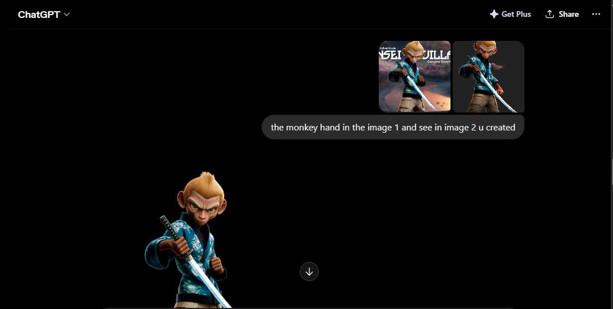
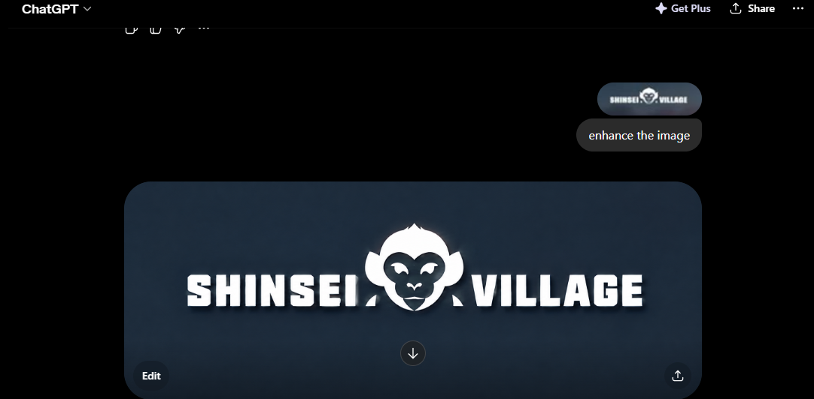
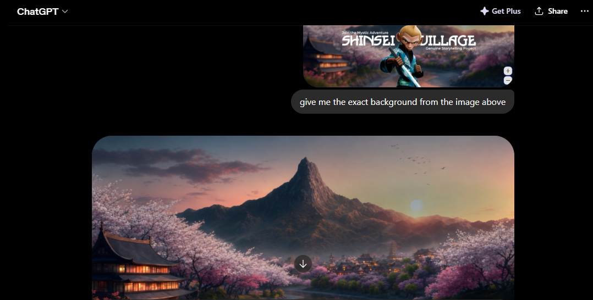

## Shinsei Village — UI Clone

A pixel-perfect frontend clone of the Shinsei Village project landing page, built with vanilla HTML and SCSS.

## Tech Stack
* HTML5
* SCSS (compiled to CSS)
* RemixIcon
* Google Fonts — Audiowide, Montserrat

## Features
* Clipped hero section using clip-path: ellipse()
* Blurred background via ::before pseudo-element
* Navbar hover effect with gradient fill and top border
* Custom gold diamond divider
* Two-column text layout for Vision section
* Fully positioned character image overlay

## Tools & Assets
* ChatGPT — generated the monkey character image, background image, and logo
* Claude — provided guidance on the ellipse clip-path, blurred background technique, and diamond shape CSS
* Canva — used for background removal on the monkey character image

      

## Live Demo

Explore the live version of the Shinsei Village Landing Page here:
[shinsevillageui.netlify.app](shinsevillageui.netlify.app)
